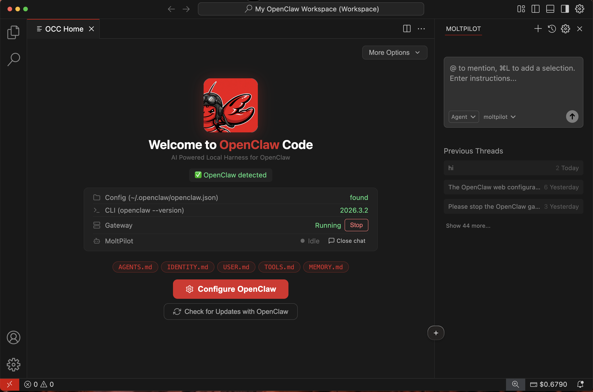

<p align="center">
  
</p>

<h1 align="center">OpenClaw Code</h1>

<p align="center">
  <strong>AI-Powered Local Harness for OpenClaw</strong><br/>
  Set up, manage, and troubleshoot your OpenClaw agent — no terminal needed.
</p>

<p align="center">
  <a href="https://github.com/damoahdominic/occ/releases"></a>
  <a href="https://github.com/damoahdominic/occ/releases"></a>
  <a href="https://github.com/damoahdominic/occ/stargazers"></a>
  <a href="https://github.com/damoahdominic/occ/blob/main/LICENSE"></a>
  <a href="https://discord.gg/openclaw"></a>
</p>

<p align="center">
  <a href="https://openclawcode.ai">Website</a> •
  <a href="https://docs.openclawcode.ai">Docs</a> •
  <a href="https://github.com/damoahdominic/occ/releases">Download</a> •
  <a href="https://mba.sh">Community</a>
</p>

---

<p align="center">
  
</p>

## What is OCCode?

OCCode is a desktop app that puts a friendly face on [OpenClaw](https://openclaw.ai). Instead of editing config files and running terminal commands, you get a visual interface to:

- **Set up OpenClaw in minutes** — connect your accounts, pick your settings, done
- **See everything at a glance** — dashboard shows what your agent is doing and what needs attention
- **Fix problems without asking for help** — detects common issues and suggests one-click fixes
- **Change settings without the command line** — every OpenClaw config, made visual
- **Works everywhere** — Windows, macOS, and Linux

No technical knowledge required.

## Download

| Platform | Link |
|----------|------|
| **macOS** (Apple Silicon) | [Download .dmg](https://github.com/damoahdominic/occ/releases/latest) |
| **macOS** (Intel) | [Download .dmg](https://github.com/damoahdominic/occ/releases/latest) |
| **Windows** | [Download .exe](https://github.com/damoahdominic/occ/releases/latest) |
| **Linux** | [Download .AppImage](https://github.com/damoahdominic/occ/releases/latest) |

Or visit [openclawcode.ai](https://openclawcode.ai) for auto-detected download links.

## Quick Start

1. **Download** OCCode for your platform
2. **Open** the app — it detects your OpenClaw installation automatically
3. **Follow the setup wizard** to connect your accounts and configure your agent
4. **You're ready** — manage everything from the dashboard

## Architecture

```
apps/
  editor/         # Desktop app (VS Code fork with OpenClaw extension)
  extension/      # OpenClaw extension — Home screen, Setup wizard, Status panel
  web/            # Marketing website (openclawcode.ai)
packages/
  control-center/ # Shared UI components for the control center
occ-backend/      # Backend API (auth, billing, inference proxy)
```

## Development

### Prerequisites

- Node.js 20+
- npm 10+
- Git

### Setup

```bash
# Clone the repo
git clone https://github.com/damoahdominic/occ.git
cd occ

# Install dependencies
npm install

# Run the marketing site locally
cd apps/web
npm run dev
```

### Building the Desktop App

```bash
# Build the editor
cd apps/editor
npm run build

# Package for your platform
npm run package
```

## Contributing

We welcome contributions! Here's how to get started:

1. Fork the repo
2. Create a feature branch (`git checkout -b feature/my-feature`)
3. Commit your changes (`git commit -m 'Add my feature'`)
4. Push to the branch (`git push origin feature/my-feature`)
5. Open a Pull Request

Please read our [Contributing Guide](CONTRIBUTING.md) for details on our code of conduct and development process.

## Community

- 🌐 [Website](https://openclawcode.ai)
- 📖 [Documentation](https://docs.openclawcode.ai)
- 💬 [Community Hub](https://mba.sh)
- 🐛 [Report a Bug](https://github.com/damoahdominic/occ/issues/new?template=bug_report.md)
- 💡 [Request a Feature](https://github.com/damoahdominic/occ/issues/new?template=feature_request.md)

## License

This project is open source. See the [LICENSE](LICENSE) file for details.

---

<p align="center">
  Built with ❤️ by the <a href="https://mba.sh">Making Better Agents</a> community
</p>

## Contributors

<a href=https://github.com/damoahdominic/occ/graphs/contributors>
  
</a>

Made with [contrib.rocks](https://contrib.rocks).

## Star History

<p align="center">
  <a href="https://star-history.com/#damoahdominic/occ&Date">
    <picture>
      <source media="(prefers-color-scheme: dark)" srcset="https://api.star-history.com/svg?repos=damoahdominic/occ&type=Date&theme=dark" />
      <source media="(prefers-color-scheme: light)" srcset="https://api.star-history.com/svg?repos=damoahdominic/occ&type=Date" />
      
    </picture>
  </a>
</p>
