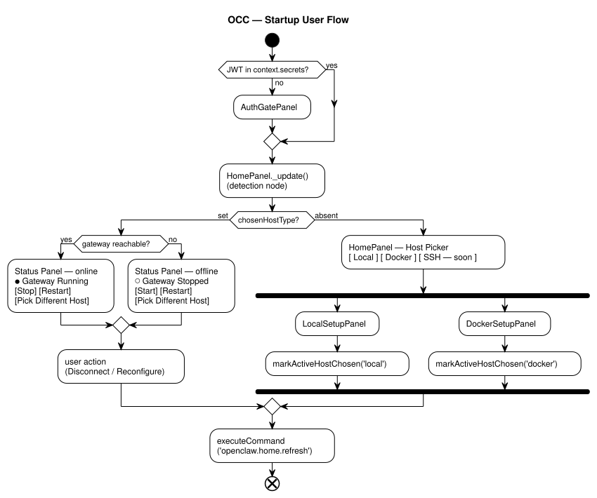

# UI Design — MultiHost Experience

## 0. Startup User Flow



<details>
<summary>ASCII fallback (for terminal / code-review views)</summary>

```
                                    ●
                                    │
                                    ▼
                       ╱─────────────────────────╲
                       │ JWT in context.secrets? │
                       ╲──no─────────────────yes─╱
                           │                 │
                           ▼                 │
                  [ AuthGatePanel ]          │
                           │                 │
                           └────────┬────────┘
                                    ▼
                       [ HomePanel._update() ]
                       [  (detection node)   ]
                                    │
                           ╱─────────────────╲
                           │ chosenHostType? │
                           ╲──set─────absent─╱
                               │         │
                               ▼         ▼
                  ╱───────────────╲     [ HomePanel — Host Picker ]
                  │gateway reach? │     [ [Local] [Docker] [SSH…] ]
                  ╲──yes──────no──╱                 │
                      │       │           ━━━━━━━━━━┻━━━━━━━━━━
                      ▼       ▼           │                   │
           [Status panel] [Status panel]  ▼                   ▼
           [  — online  ] [  — offline ]  [LocalSetupPanel]   [DockerSetupPanel]
                      │       │           │                   │
                      └───┬───┘           ▼                   ▼
                          ▼          [markActiveHost-    [markActiveHost-
                  [ user action ]     Chosen('local')]    Chosen('docker')]
                  [  Disconnect/]          │                   │
                  [  Reconfigure]          └─────────┬─────────┘
                          │                         │
                          └────────────┬────────────┘
                                 ━━━━━━┻━━━━━━
                                       │
                                       ▼
                       [ executeCommand              ]
                       [   ('openclaw.home.refresh') ]
                                       │
                                       ▼
                                       ⊗
```

Legend: `●` start  ·  `⊗` end  ·  `╱ ╲` decision  ·  `[ ]` action  ·  `━━━` fork/join bar.

</details>

**Key callouts** (moved out of the diagram to keep it notation-minimal, UML activity style):

- **AuthGatePanel** (`authGate.ts`) runs when no JWT is in `context.secrets`. It opens the browser to `occode:///auth?token=...`, stores the returned JWT, and fires `onAuthCompleted` to release the gate.
- **`HomePanel._update()` is the detection node.** Per **ticket-053**, it routes on the persisted `chosenHostType` marker in `hosts.json` — *not* on a live gateway probe. Reachability only chooses between the Status-online and Status-offline render; it never flips the view back to the host-picker once setup has completed.
- **`executeCommand('openclaw.home.refresh')`** at the bottom closes one iteration of the flow. Every subsequent user action that needs to re-evaluate state (Disconnect, Reconfigure, setup completion) fires this command, which re-enters `HomePanel._update()` — the ⊗ is the end of one pass, not the end of the session.

*Diagram source: [`diagrams/startup-flow.puml`](./diagrams/startup-flow.puml). Re-render with `./diagrams/render.sh [svg|png]` (requires Docker — uses `plantuml/plantuml:latest`).*

### Flow rules

1. **Auth gate comes first.** App activation calls `initAuthGate(context, extensionUri)` before `routeHome()`. If no JWT is in `context.secrets`, **`AuthGatePanel`** (from `apps/editor/extensions/openclaw/src/authGate.ts`) opens. The deep-link handler in `extension.ts` stores the JWT and fires `onAuthCompleted`, which closes `AuthGatePanel` and lets `routeHome()` proceed. **`HomePanel` never opens before auth completes.**
2. **HomePanel is the detection node.** There is no separate "Detect Gateway" component — `HomePanel._update()` (`panels/home.ts`) **is** the detection node. It probes the gateway, then conditionally renders either the Status view (via `StatusPanelController`) or the host-picker HTML. Because `HomePanel` is the entrypoint that launches the host-setup panels in the first place, setup panels can always assume `HomePanel` exists.
3. **Setup completion re-enters `HomePanel`, not Status directly.** `LocalSetupPanel`, `DockerSetupPanel`, and (future) `SSHSetupPanel` must call `vscode.commands.executeCommand('openclaw.home.refresh')` on their last step instead of swapping HTML. The `openclaw.home.refresh` command is owned by `HomePanel` (registered in its constructor, deliberately **not** disposed with the panel so it survives setup-panel lifecycle). The command invokes `HomePanel._update()`, which decides Status vs. host-picker based on probe results — a single source of truth for "is the gateway up?".
4. **Disconnect loops to the same detection node.** Disconnecting from the Status view fires `openclaw.home.refresh`; when nothing is running, `HomePanel` renders the host-picker.
5. **No direct setup → Status jump.** Setup panels must not call `StatusPanelController.show()` or swap the webview to Status HTML on their own. The old edge from "gateway now running" directly into Status has been removed from `DockerSetupPanel._handleLaunchGateway()` and replaced with a refresh command dispatch.
6. **Persisted host choice beats gateway reachability for view routing** *(ticket-053)*. `HomePanel._update()` routes on an **explicit-choice marker** written by the setup wizards on success (`HostRegistry.markActiveHostChosen()`), NOT on a live gateway probe. Reachability only decides between a Status-online and a Status-offline render — it never flips the view back to the host-picker once the user has completed setup. The picker only appears when (a) no explicit choice has been recorded, or (b) `openclaw.host.reconfigure` has been invoked to clear the marker. See ticket-053 §2.4 for the schema mechanism and the Option 1-4 alternatives considered.

## 0a. Status Panel — Offline & Control *(ticket-053)*

Once `HomePanel._update()` has decided to render the Status panel (because the
explicit-choice marker is set — see Rule 6), the Status panel itself has two
modes plus a universal escape hatch:

```
┌─────────────────────────────────────────────────────────────┐
│ Status Panel — online                                       │
│                                                             │
│  ● Gateway Running   v2026.3                                │
│  [  Stop  ]  [  Restart  ]                                  │
│                                                             │
│  Host: Docker — occ-openclaw                                │
│  (activity / agents / channels panels)                      │
│                                                             │
│                              [ Pick Different Host ]        │
└─────────────────────────────────────────────────────────────┘

┌─────────────────────────────────────────────────────────────┐
│ Status Panel — offline                                      │
│                                                             │
│  ○ Gateway Stopped                                          │
│  [  Start  ]                                                │
│                                                             │
│  Host: Docker — occ-openclaw   (last seen 2m ago)           │
│                                                             │
│                              [ Pick Different Host ]        │
└─────────────────────────────────────────────────────────────┘
```

**Start / Stop / Restart buttons.** The button template already exists at
`apps/editor/extensions/openclaw/src/panels/statusHtml.ts:1214-1219` with the
state machine `running → Stop`, `stopped → Start`, `errored → Restart` and
intermediate `starting / stopping / restarting` spinners. ticket-053 wires the
existing `gatewayAction` postMessage (`statusHtml.ts:1256`) through to three new
VS Code commands — `openclaw.gateway.start`, `openclaw.gateway.stop`,
`openclaw.gateway.restart` — which each resolve the active
`HostConnection` and call the matching `gatewayStart / gatewayStop / gatewayRestart`
method (`hosts/types.ts:256-258`). Per-adapter:

- **Local adapter** shells to `openclaw gateway start/stop/restart` — see
  [`04-local-adapter.md` "Gateway Lifecycle"](./04-local-adapter.md).
- **Docker adapter** shells to
  `docker compose -f docker/docker-compose.openclaw.yml up -d / down / restart`
  on the user's workstation — see
  [`05-docker-adapter.md` "Gateway Lifecycle"](./05-docker-adapter.md) and the
  root `AGENTS.md` § "OpenClaw Docker Gateway".

**Reconfigure escape hatch.** The "Pick Different Host" button dispatches a new
`openclaw.host.reconfigure` command that:

1. Clears the explicit-choice marker via `HostRegistry.markActiveHostChosen`
   (inverse / unset).
2. Sets `HomePanel.currentPanel._forcePicker = true`.
3. Dispatches `openclaw.home.refresh`.

This is the only way a user with a persisted host choice can return to the
picker — it un-jails users whose adapter has broken (Docker uninstalled,
compose file deleted, corrupted `hosts.json`) and is also exposed as a palette
command so it can be invoked even if the Status page is unresponsive.

## 1. Status Bar Host Picker

The most-used UI element. Shows the active host in the VS Code status bar.

```
┌─────────────────────────────────────────────────────────────────┐
│ File  Edit  Selection  View  ...                                │
├─────────────────────────────────────────────────────────────────┤
│                                                                 │
│                    (editor area)                                │
│                                                                 │
├─────────────────────────────────────────────────────────────────┤
│ ● My Laptop (Local)  │  main  │  ▶ Gateway Running  │  $4.32  │
└─────────────────────────────────────────────────────────────────┘
  ↑                       ↑          ↑                    ↑
  Host picker            Branch     Gateway status      Balance
```

### Clicking the Host Picker → Quick Pick

```
┌─────────────────────────────────────────────────────────┐
│ 🔍 Select OpenClaw Host                                 │
├─────────────────────────────────────────────────────────┤
│                                                         │
│  Active                                                 │
│  ──────                                                 │
│  🖥️  My Laptop              Local     ● Online          │
│                                                         │
│  Available                                              │
│  ─────────                                              │
│  🐳  MoltPod Dev             Docker    ● Online          │
│  🌐  Production VPS          SSH       ● Online          │
│  ☁️  Staging Pod              Cloud     ○ Offline         │
│                                                         │
│  ──────────────────────────────────────────────         │
│  ➕  Add New Host...                                     │
│  🔄  Refresh All                                         │
│  ⚙️  Manage Hosts...                                     │
│                                                         │
└─────────────────────────────────────────────────────────┘
```

### Implementation

```typescript
export class HostStatusBarItem {
  private item: vscode.StatusBarItem;
  
  constructor(
    private hostManager: HostManager,
    private registry: HostRegistry,
  ) {
    this.item = vscode.window.createStatusBarItem(vscode.StatusBarAlignment.Left, 100);
    this.item.command = 'occ.hosts.pick';
    this.update();
    
    hostManager.onDidChangeActiveHost(() => this.update());
    hostManager.onDidChangeHostStatus(() => this.update());
  }
  
  private update(): void {
    const host = this.hostManager.getActiveConnection();
    if (!host) {
      this.item.text = '$(server) No Host';
      this.item.tooltip = 'Click to select an OpenClaw host';
      this.item.backgroundColor = new vscode.ThemeColor('statusBarItem.warningBackground');
    } else {
      const icon = this.getTypeIcon(host.hostEntry.type);
      const status = host.status === 'connected' ? '●' : '○';
      this.item.text = `${icon} ${host.hostEntry.label}`;
      this.item.tooltip = `${host.hostEntry.label} (${host.hostEntry.type}) — ${host.status}`;
      this.item.backgroundColor = host.status === 'error'
        ? new vscode.ThemeColor('statusBarItem.errorBackground')
        : undefined;
    }
    this.item.show();
  }
  
  private getTypeIcon(type: string): string {
    switch (type) {
      case 'local': return '$(device-desktop)';
      case 'docker': return '$(package)';
      case 'ssh': return '$(remote)';
      case 'cloud': return '$(cloud)';
      default: return '$(server)';
    }
  }
}
```

## 2. Sidebar Tree View — Hosts Panel

A dedicated sidebar section showing all registered hosts with real-time status.

```
┌───────────────────────────────────┐
│ OPENCLAW HOSTS                 🔄 │
├───────────────────────────────────┤
│                                   │
│ ▼ 🖥️  My Laptop           ● ✓    │
│   ├── Gateway: Running v2026.3    │
│   ├── Agents: main, cody          │
│   ├── Channels: 3 connected       │
│   └── ⚡ Open Terminal             │
│                                   │
│ ▶ 🐳  MoltPod Dev          ●      │
│                                   │
│ ▶ 🌐  Production VPS       ●      │
│                                   │
│ ▶ ☁️  Staging Pod           ○      │
│   └── ⚠️  Pod stopped              │
│                                   │
│ ─────────────────────────         │
│ ➕ Add Host                        │
│                                   │
└───────────────────────────────────┘
```

### Context Menus

Right-click a host:
```
┌─────────────────────────────┐
│ Set as Active               │
│ ─────────────               │
│ Open Explorer               │
│ Open Terminal               │
│ Open Gateway Dashboard      │
│ ─────────────               │
│ Start Gateway               │
│ Stop Gateway                │
│ Restart Gateway             │
│ ─────────────               │
│ Edit Host                   │
│ Refresh Status              │
│ ─────────────               │
│ Remove Host                 │
└─────────────────────────────┘
```

### Implementation

```typescript
export class HostTreeProvider implements vscode.TreeDataProvider<HostTreeItem> {
  private _onDidChangeTreeData = new vscode.EventEmitter<HostTreeItem | undefined>();
  readonly onDidChangeTreeData = this._onDidChangeTreeData.event;
  
  constructor(
    private registry: HostRegistry,
    private hostManager: HostManager,
  ) {
    registry.onDidChange(() => this.refresh());
    hostManager.onDidChangeActiveHost(() => this.refresh());
    hostManager.onDidChangeHostStatus(() => this.refresh());
  }
  
  refresh(): void {
    this._onDidChangeTreeData.fire(undefined);
  }
  
  getTreeItem(element: HostTreeItem): vscode.TreeItem {
    return element;
  }
  
  async getChildren(element?: HostTreeItem): Promise<HostTreeItem[]> {
    if (!element) {
      // Root level — show all hosts
      const hosts = this.registry.getAllHosts();
      const activeId = this.hostManager.getActiveConnection()?.hostId;
      
      return hosts.map(host => {
        const isActive = host.id === activeId;
        const cache = this.readCache(host.id);
        
        return new HostTreeItem(
          host,
          isActive,
          cache,
          vscode.TreeItemCollapsibleState.Collapsed,
        );
      });
    }
    
    // Child level — show host details
    const cache = this.readCache(element.hostEntry.id);
    if (!cache) return [];
    
    const children: HostTreeItem[] = [];
    
    if (cache.gateway) {
      children.push(new HostDetailItem(
        `Gateway: ${cache.gateway.running ? `Running v${cache.gateway.version}` : 'Stopped'}`,
        cache.gateway.running ? 'pass' : 'error',
      ));
    }
    
    if (cache.agents) {
      children.push(new HostDetailItem(
        `Agents: ${cache.agents.names.join(', ')}`,
        'info',
      ));
    }
    
    if (cache.channels) {
      children.push(new HostDetailItem(
        `Channels: ${cache.channels.connected.length} connected`,
        cache.channels.connected.length > 0 ? 'pass' : 'warning',
      ));
    }
    
    // Quick action items
    children.push(new HostActionItem('Open Terminal', 'occ.hosts.openTerminal', element.hostEntry.id));
    children.push(new HostActionItem('Open Explorer', 'occ.hosts.openExplorer', element.hostEntry.id));
    
    return children;
  }
}
```

## 3. Add Host Wizard

A multi-step Quick Input wizard that guides users through adding a new host.

### Step 1: Choose Host Type

```
┌─────────────────────────────────────────────────────────┐
│ 🔍 What kind of host?                                   │
├─────────────────────────────────────────────────────────┤
│                                                         │
│  🖥️  Local Machine                                       │
│     OpenClaw on this computer                            │
│                                                         │
│  🐳  Docker Container                                    │
│     OpenClaw running in a Docker container               │
│                                                         │
│  🌐  SSH Remote                                          │
│     OpenClaw on a remote server via SSH                  │
│                                                         │
│  ☁️  MoltPod Cloud                                       │
│     Managed OpenClaw pod on MoltPod                     │
│                                                         │
└─────────────────────────────────────────────────────────┘
```

### Step 2: Discovery (optional)

```
┌─────────────────────────────────────────────────────────┐
│ 🔍 Found 3 Docker containers with OpenClaw               │
├─────────────────────────────────────────────────────────┤
│                                                         │
│  🐳  openclaw-pod-1 (openclaw/pod:latest)    ● Running  │
│  🐳  openclaw-dev (openclaw/pod:dev)          ● Running  │
│  🐳  test-pod (ubuntu:22.04)                  ● Running  │
│                                                         │
│  ─────────────────────────────────────────              │
│  ✏️  Configure manually...                               │
│                                                         │
└─────────────────────────────────────────────────────────┘
```

### Step 3: Configuration Fields

Dynamic form based on adapter's `getConfigFields()`:

```
┌─────────────────────────────────────────────────────────┐
│ Configure SSH Host                          Step 3 of 4 │
├─────────────────────────────────────────────────────────┤
│                                                         │
│  Label:     [Production VPS________________]            │
│  Hostname:  [45.76.229.198_________________]            │
│  Port:      [22___]                                     │
│  Username:  [debian________________________]            │
│  Auth:      [SSH Key ▼]                                 │
│  Key Path:  [~/.ssh/id_ed25519_____________]            │
│                                                         │
│  ▶ Advanced                                             │
│                                                         │
│  [Test Connection]          [Back]  [Add Host]          │
│                                                         │
└─────────────────────────────────────────────────────────┘
```

### Step 4: Test & Confirm

```
┌─────────────────────────────────────────────────────────┐
│ ✅ Connection Successful                                 │
├─────────────────────────────────────────────────────────┤
│                                                         │
│  Host:      45.76.229.198                               │
│  OS:        Linux (Debian 13)                           │
│  OpenClaw:  v2026.3.19                                  │
│  Gateway:   Running on port 18789                       │
│  Agents:    main, cody                                  │
│                                                         │
│  [Add Host and Set Active]    [Add Host]    [Cancel]    │
│                                                         │
└─────────────────────────────────────────────────────────┘
```

## 4. Control Center — Multi-Host Dashboard

When no specific host is selected, the control center shows an overview of all hosts:

```
┌─────────────────────────────────────────────────────────────┐
│  ● Control Center                                           │
│                                                             │
│  ┌──────────┐  ┌──────────┐  ┌──────────┐  ┌────────────┐ │
│  │ 4 Hosts  │  │ 3 Online │  │ 7 Agents │  │ 12 Channels│ │
│  │          │  │          │  │          │  │            │ │
│  └──────────┘  └──────────┘  └──────────┘  └────────────┘ │
│                                                             │
│  ┌─────────────────────────────────────────────────────┐   │
│  │ Host                  Type    Status   Agents  GW   │   │
│  ├─────────────────────────────────────────────────────┤   │
│  │ My Laptop             Local   Online   2       ▶    │   │
│  │ MoltPod Dev           Docker  Online   1       ▶    │   │
│  │ Production VPS        SSH     Online   3       ▶    │   │
│  │ Staging Pod           Cloud   Offline  1       ■    │   │
│  └─────────────────────────────────────────────────────┘   │
│                                                             │
│  Recent Activity                                            │
│  ───────────────                                            │
│  10:15  Production VPS  Gateway restarted                   │
│  10:02  My Laptop       Agent "cody" heartbeat              │
│  09:45  MoltPod Dev     Channel WhatsApp connected          │
│                                                             │
└─────────────────────────────────────────────────────────────┘
```

## 5. Visual Differentiation

Each host type gets a unique visual treatment so users always know which host they're working with:

### Color Coding (optional per-host)

```typescript
const hostColors: Record<string, string> = {
  local:  '#22c55e',  // Green — home base
  docker: '#3b82f6',  // Blue — containers
  ssh:    '#f59e0b',  // Amber — remote
  cloud:  '#8b5cf6',  // Purple — managed
};
```

### Status Bar Color Changes

When connected to a non-local host, the status bar background can change to indicate remote context (similar to VS Code Remote):

```typescript
// Set the remote name indicator (bottom-left corner)
function updateRemoteIndicator(host: HostEntry): void {
  if (host.type !== 'local') {
    vscode.commands.executeCommand('setContext', 'occ.remoteHost', host.label);
    // The remote indicator shows in the bottom-left:
    // [🌐 Production VPS]  ← amber background
  }
}
```

## 6. Notifications & Alerts

### Host Goes Offline

```
┌────────────────────────────────────────────┐
│ ⚠️ Production VPS is offline               │
│                                            │
│ The SSH connection to 45.76.229.198 was    │
│ lost. Last seen 2 minutes ago.             │
│                                            │
│ [Reconnect]  [Switch Host]  [Dismiss]      │
└────────────────────────────────────────────┘
```

### Gateway Crash on Active Host

```
┌────────────────────────────────────────────┐
│ 🔴 Gateway stopped on My Laptop            │
│                                            │
│ The OpenClaw gateway is no longer running. │
│ Agents and channels are offline.           │
│                                            │
│ [Restart Gateway]  [View Logs]  [Dismiss]  │
└────────────────────────────────────────────┘
```

### New Host Discovered

```
┌────────────────────────────────────────────┐
│ 🐳 New Docker container detected           │
│                                            │
│ "openclaw-pod-2" has OpenClaw installed.   │
│                                            │
│ [Add as Host]  [Ignore]                    │
└────────────────────────────────────────────┘
```
